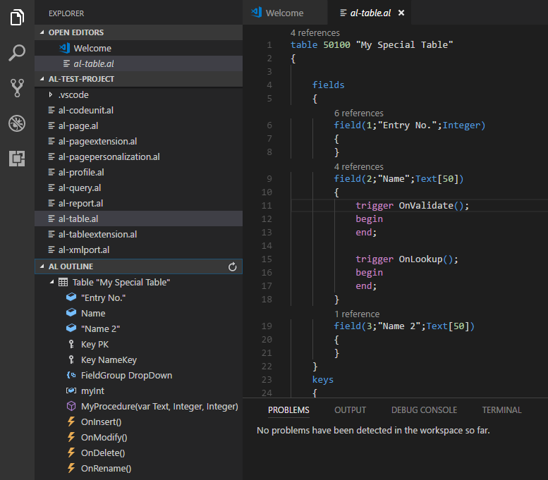
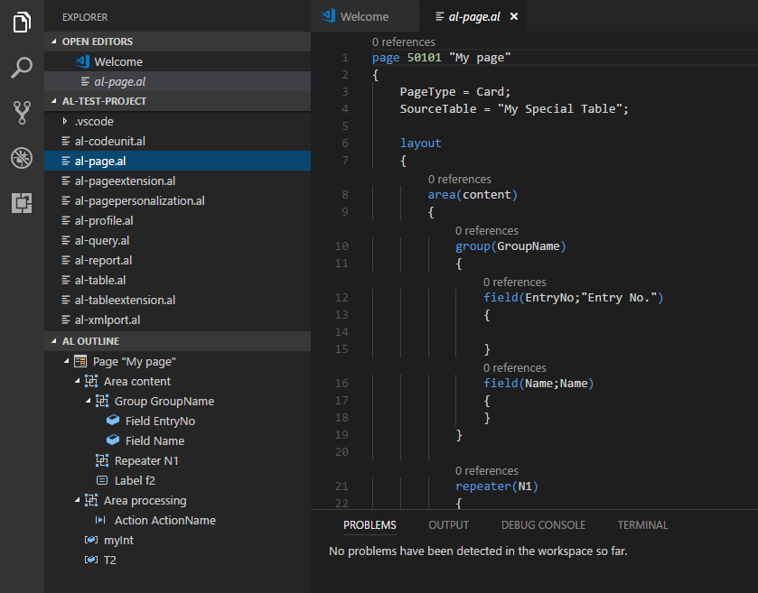
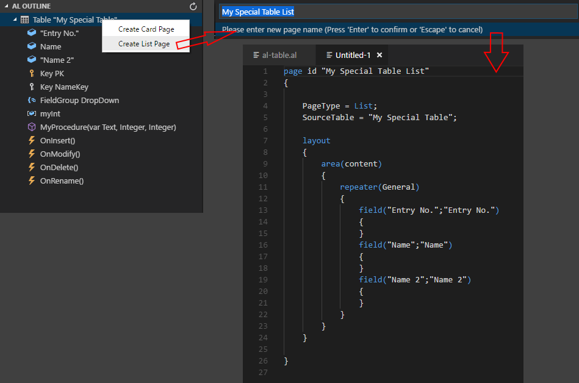

# AL Code Outline for Visual Studio Code

## Features

The AL Code Outline extension displays code outline tree of active file in the explorer pane. It was initially created to support AL files only, but AL project can also contain other file types for data (xml, json) and client add-ins (javascript, css, html, handlebars) so symbols tree works for them too. Basic functionality that works for all file types allows user to click on one of tree nodes in AL Outline view to move cursor to that symbol in the code editor. For AL file types, extensions tries to extract more information about source code and can display context menu with additional options for some of symbols. 

At this moment, context menu works for 'Table' symbol only and allows user to create new card or list page with all fields from selected table.

## Inspiration

This extension has been inspired by "Code Outline" extension created by Patryk Zawadzki and "Tree Data Provider" example from "VS Code Extension Examples". I've decided to create it because I wanted something that could understand AL object structure and to be able to add some AL specific commands to tree nodes in the future. 

## Settings

This extension contributes the following settings:

* `alOutline.autorefresh`: refresh code outline tree automatically

## Known Issues

- When AL project is opened in Visual Studio Code, AL Code Outline pane might not be visible even if one of *.al files is opened. You have to switch to another al file to display it.
- It takes some time to parse all *.al files when new project is opened so code outline will stay empty during that time. You can use Refresh button to force it to reload content. 

