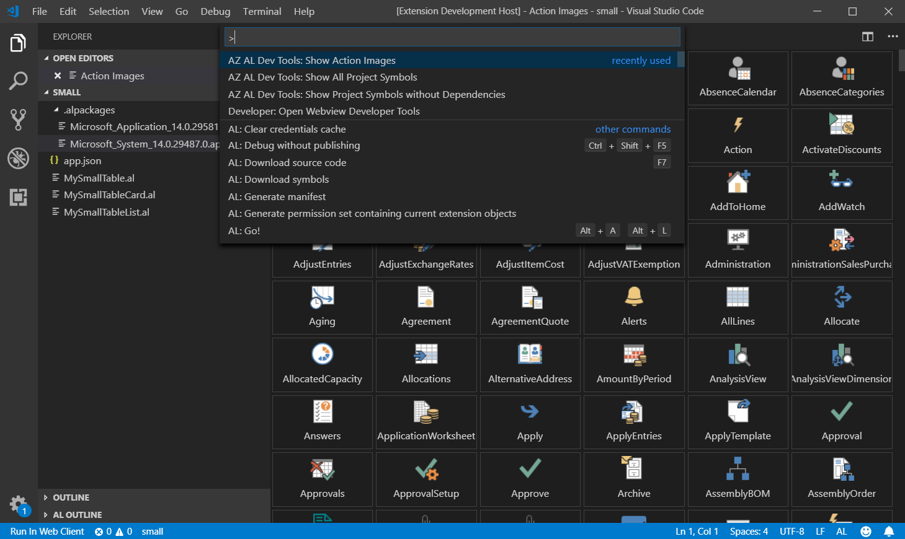

# AZ AL Dev Tools/AL Code Outline for Visual Studio Code

This extension was originally named 'AL Code Outline' because it started as AL code outline panel from which it was possible to run different code generators on AL syntax nodes. Each new version has been adding new features, some of them were no longer related to the AL code outline panel. Current version of the extension is a collection of different al development tools and al outline panel is just one of them, so it seems that the name should be updated to reflect functionality changes.

## Features

"AZ AL Dev Tools/AL Code Outline" extension is a collection of these tools designed to help with AL extension development:
- AL objects wizards
- Symbols browser
- AL symbols outline panel
- AL code generators
- Code actions
- Action images browser

### AL objects wizards

Extensions add new "New AL File Wizard" item to EXPLORER context menu. It allows to run one of these wizards to create new AL object file:
   - Page Wizard
   - XmlPort Wizard
   - Report Wizard
   - Query Wizard
   - Enum Wizard
   - Enum Extension Wizard

 

### Symbols browser

Symbols browser shows list of AL objects, allows to select one of them and then display details of that symbol. It is also possible to select multiple objects (by clicking on nodes with Ctrl key or using Ctrl+A) and then use context menu to run one of code generator on them. Browser can display symbols in 2 modes - list and tree view. In tree view screen is split into two parts showing objects tree on the left side and selected symbol on the right. In list view browser shows flat list of symbols and uses "AL Outline" panel to show details of selected object.

Both views allow to filter data, tree view shows filter fields at the top of the screen, list view uses context menu on the header fields to set or clear filters.

Tree view also supports keyboard navigation using arrow keys.

Symbols browser can display symbols from:
 - *.app symbols file by right clicking on it and using "Open in AL Browser" command from the context menu
 - current project symbols with all dependencies defined in app.json by running "AZ AL Dev Tools: Show All Project Symbols" from the "Command Palette"
 - current project symbols without dependencies by running "AZ AL Dev Tools: Show Project Symbols without Dependencies" from the "Command Palette"

### AL symbols outline panel

'AL Outline' panel displays code outline of the currently active editor. Basic functionality allows user to click on one of the symbols tree nodes to move cursor to that symbol in the code editor. It looks like standard VS Code Outline view, but supports syntax node types specific to AL, display custom icons and allows to invoke some commands on them using context menu. Currently symbol context menu allows user to run pages, reports and tables in the web client and run code generators to create new card and list pages, reports, xmlports and queries with all fields from selected table symbols. For tables and pages it is also possible to create page or table extension.

It also supports other document types, so it can be used instead of standard outline view if AL project contains other files (i.e. javascript or css control add-ins files).

### AL code generators

Extension contains code generators that can create new card and list pages, reports, xmlports and queries with all fields from selected table symbols. It can also create empty page or table extension from page or table symbols. Generators can be invoked using context menu on symbols in "AL Outline" view and in "Symbols Browser". 

When new objects are created, generators use "CRS AL Language Extension" templates functionality to suggest file names.

### Code actions

Extension adds VS Code editor code actions to some of al elements to help developers modify or insert code quickly. At this moment "Add multiple fields" code action is available when cursor is at these elements in the editor:
 - "group" and "repeater" on pages
 - "group", "repeater", "addfirst", "addlast", "addafter" and "addbefore" on page extensions
 - "dataitem" on reports
 - "dataitem" on queries 

### Action images browser

Extension adds new "AZ AL Dev Tools: Show Action Images" command to the "Command Palette" to load all available action images from active Microsoft AL Language extension and show them on a single web view panel. 

## Contributors

- rvanbekkum: 
  * "New Page Extension" and "New Table Extension" options in AL Object Browser
  * Ability to save generated objects in files inside project folder
  * AL Object Browser filters

## Inspiration

This extension has originally been inspired by "Code Outline" extension created by Patryk Zawadzki and "Tree Data Provider" example from "VS Code Extension Examples". I've decided to create it because I wanted something that could understand AL object structure and to be able to add some AL specific commands to tree nodes in the future. 

## Settings

This extension contributes the following settings:

* `alOutline.enableFeaturePreview`: enable preview of future, unstable features
* `alOutline.autorefresh`: refresh code outline tree automatically
* `alOutline.autoGenerateFiles`: automatically generate files for newly created objects
* `alOutline.autoGenerateFileDirectory`: the default directory to create files in, relative to the root directory (e.g., \"Source\<ObjectType\>\")
* `alOutline.autoShowFiles`: automatically show any newly created files in the editor
* `alOutline.defaultAppArea`: default application area for page code generator
* `alOutline.defaultListUsageCategory`: default usage category for list pages
* `alOutline.promptForObjectId`: when generating a new object, ask the user to input the object ID.
* `alOutline.promptForObjectName`: when generating a new object, ask the user to input the object name
* `alOutline.promptForFilePath`: when generating a new file, ask the user to specify a path relative to the root of the project-folder
* `alOutline.stripNonAlphanumericCharactersFromObjectNames`: always strip non-alphanumeric characters from generated object names
* `alOutline.webClientPort`: web client port number, use 0 for default http/https ports

## Known Issues

- When AL project is opened in Visual Studio Code, AL Code Outline pane might not be visible or might be empty even if one of *.al files is opened. You have to switch to another al file to display/refresh it.
- It takes some time to parse all *.al files when new project is opened so code outline will stay empty during that time. You can use Refresh button to force it to reload content. 
- Extension uses CRS-AL-LANGUAGE-EXTENSION for generating file names for new objects. As a result you will see plenty of new snippets added by the CRS extension. If you don't want to see them, go to Visual Studio settings and disable them in CRS-AL-LANGUAGE-EXTENSION section.

## About me

I'm .net and Dynamics Nav developer that moved from .net world to Dynamics Nav world in 2004. I've been using these 2 technologies since that year and currently I work as a Product Developer at The NAV People - the UK's number one reseller focused solely on Dynamics NAV thanks to its mission to provide a high level of expertise, amazing product innovation and the absolute best standard of customer service. The NAV People is truly unique in the world of NAV, check out our story here: https://thenavpeople.com/our-story 