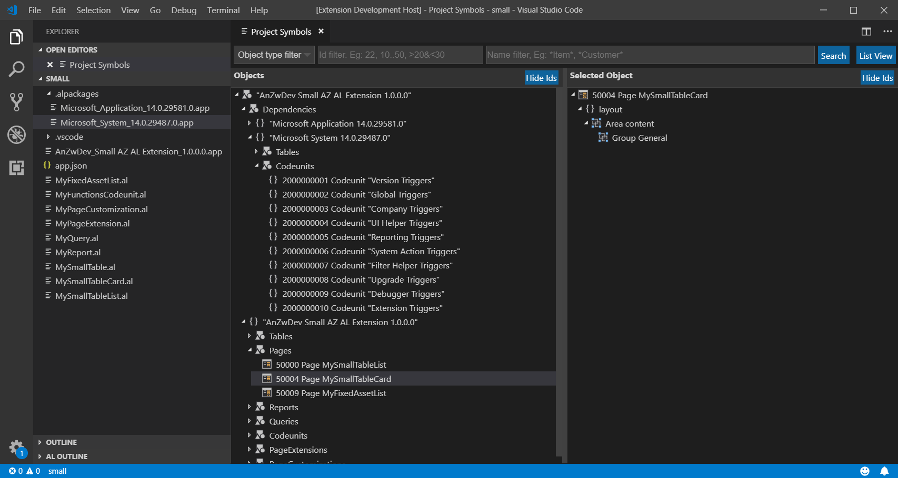

# AZ AL Dev Tools/AL Code Outline for Visual Studio Code

This extension was originally named 'AL Code Outline' because it started as AL code outline panel from which it was possible to run different code generators on AL syntax nodes. Each new version has been adding new features, some of them were no longer related to the AL code outline panel. Current version of the extension is a collection of different al development tools and al outline panel is just one of them, so it seems that the name should be updated to reflect functionality changes.

## Features

"AZ AL Dev Tools/AL Code Outline" extension is a collection of these tools designed to help with AL extension development:
- AL objects wizards
- Symbols browser
- AL symbols outline panel
- Symbols tree view
- AL code generators
- Code actions
- Code transformation commands
- Action images browser
- Custom editors
- Documentation comments support
- Duplicate code search
- Warning directives panel
- Code analyzers rules viewer
- Document syntax visualizer
- Code completion

### AL objects wizards

Extensions add new "New AL File Wizard" item to EXPLORER context menu. It allows to run one of these wizards to create new AL object file:
   - Table Wizard
   - Table Extension Wizard
   - Page Wizard
   - Codeunit Wizard
   - Interface Wizard
   - XmlPort Wizard
   - Report Wizard
   - Query Wizard
   - Enum Wizard
   - Enum Extension Wizard
   - PermissionSet Wizard
   - PermissionSetExtension Wizard

 

### Symbols browser

Symbols browser shows list of AL objects, allows to select one of them and then display details of that symbol. It is also possible to select multiple objects (by clicking on nodes with Ctrl key or using Ctrl+A) and then use context menu to run one of code generators on them. Browser can display symbols in 2 modes - list and tree view. In tree view screen is split into two parts showing objects tree on the left side and selected symbol on the right. In list view browser shows flat list of symbols and uses "AL Outline" panel to show details of selected object.

Both views support keyboard navigation with arrow keys and allow to filter data by using filter fields at the top of the screen.

Symbols browser can display symbols from:
 - *.app symbols files - extension registers default custom read only editor for these files so symbols browser can be opened by just clicking on the file in the EXPLORER panel. If it does not work, it means that other editor has been selected as default. In that case symbols browser can still be open by right clicking on the file, selecting "Open With..." from the context menu and choosing "AL App Viewer" editor.  
 - current project symbols with all dependencies defined in app.json by running "AZ AL Dev Tools: Show All Project Symbols" from the "Command Palette"
 - current project symbols without dependencies by running "AZ AL Dev Tools: Show Project Symbols without Dependencies" from the "Command Palette"




### AL symbols outline panel

'AL Outline' panel displays code outline of the currently active editor. Basic functionality allows user to click on one of the symbols tree nodes to move cursor to that symbol in the code editor. It looks like standard VS Code Outline view, but supports syntax node types specific to AL, display custom icons and allows to invoke some commands on them using context menu. Currently symbol context menu allows user to run pages, reports and tables in the web client and run code generators to create new card and list pages, reports, xmlports and queries with all fields from selected table symbols. For tables and pages it is also possible to create page or table extension.

It also supports other document types, so it can be used instead of standard outline view if AL project contains other files (i.e. javascript or css control add-ins files).


### Symbols tree view

This view shows symbols tree looking similar to content of "AL symbols outline panel", but uses WebView to display it and can be opened on one of the editor tabs. If there is an editor in which user changes definition of the object displayed in the tree view, tree content will be updated, but switching active editor to other file does not change the tree. It can be used to display table symbols when user edits page object or page symbols when developers edits page extension. View can be opened from:
- AL Symbols Browser by using object list context menu and selecting "Open symbol in new tab" option
- "Show Document Symbols Tree" command from "Command Palette" when there is an acive text editor with AL file
- Editor context menu by selecting "Show Definition in the Symbols Tree" menu item


### AL code generators

Extension contains code generators that can create new card and list pages, reports, xmlports and queries with all fields from selected table symbols. It can also create empty page or table extension from page or table symbols. Generators can be invoked using context menu on symbols in "AL Outline" view and in "Symbols Browser". 

When new objects are created, generators use "CRS AL Language Extension" templates functionality to suggest file names.

### Code actions

Extension adds VS Code editor code actions to some of al elements to help developers modify or insert code quickly. At this these types of actions available:
 - Sorting actions that can sort
  - `Sort table fields` available when cursor is at the first line of table, table extension, fields keyword or table/table extension field. It will sort all fields by the field number. 
  - `Sort procedures` available when cursor is at the first line of a procedure. This action will sort procedures of the same type (i.e. local) in a natural order
  - `Sort data item columns` available when cursor is at report data item, column or first line of the object declaration. This action will sort all columns inside data item in a natural order. If it is invoked from the first line of the object, it will sort columns inside all data items.
  - `Sort properties` available from the first line of any object declaration. It will sort properties of every element declared inside the object.
  - `Sort variables` available from the first line of any object declaration or from "var" keyword of local or global variables section
  - `Sort permissions` available when cursor is at the first line of Permissions property. It will sort all entries in this property
  - `Sort permission sets` available when cursor is at the first line of IncludedPermissionSets property. It will sort all entries in this property.
  - `Sort customizations` available when cursor is at the first line of Customizations property. It will sort all entries in this property.
 - Code generation actions
  - `Create interface` action available on the first line of codeunit declaration, it creates a new interface with all public functions from the codeunit
 - `Add all extension objects permissions` available on the first line of Permissions property. It adds all objects from the current extension to this property. If permissions are added to PermissionSet or PermisionSetExtension object, `table`, `tabledata`, `page`, `report`, `xmlport`, `query` and `codeunit` entries will be added. For all other object types, only `tabledata` entries will be created.
 - `Add permissions to all tables used by this object` action available on the first line of object declaration and permissions property. It scans the object, detects operation types and adds permissions to tabledata of all non-temporary tables used inside.
 - `Reuse tooltip from other pages` action available on the first line of page/page extension field and `ToolTip` property, it allows to select tooltip value from a list of tooltips defined for this table field on other pages in the current project and all dependencies
 - `Add multiple fields` when cursor is at these elements in the editor:
  - "group" and "repeater" on pages
  - "group", "repeater", "addfirst", "addlast", "addafter" and "addbefore" on page extensions
  - "dataitem" on reports
  - "dataitem" on queries
  There are also `Add multiple field elements` and `Add multiple field attributes` actions available at "tableelement", "fieldelement" and "fieldattribute" elements on xml ports.
  Fields can be added is selection or alphabetic order, it can be controlled using "alOutline.fieldsSelectionOrder" setting. Default value is "selection order".
 - `Generate column headers for CSV export` action available on XmlPort header and XmlPort tableelement when XmlPort format is set to "VariableText". It adds a new tableelement with column headers for each tableelement in the XmlPort.


Sort table fields, procedures, variables, properties, report columns. permissions, permission sets and customizations actions can be also run automatically on document save. To turn this functionality on "source.fixAll.al" property of "editor.codeActionsOnSave" must be set to true and "alOutline.codeActionsOnSave" setting should contain list of sorting actions that you want to run. That's how settings should look like to run all these sort actions on save:

```javascript
"editor.codeActionsOnSave": {
  "source.fixAll.al": true
},
"alOutline.codeActionsOnSave": [
  "SortProcedures", "SortProperties", "SortReportColumns", "SortVariables"
]
```

There are also some additional code actions available for warnings and errors reported by CodeCop code analyzer. Because of performance reasons, there are disabled by default and can be enabled by changing "alOutline.enableCodeCopFixes" setting to true:
 - remove variable for diagnostics AA0137,
 - add CopyStr for diagnostics AA0139

### Code transformation commands

Extension adds a few commands that allow to automatically modify al code in the current editor or in all project files. Currently these commands are available:
* `Add Application Areas to the Active Editor`: adds missing application areas to all page controls in the current editor
* `Add Application Areas to the Active Project`: adds missing application areas to all page controls in the current project
* `Remove Redundant AppAreas from the Active Editor`: requires runtime 10.0 or greater and removes redundant application areas from all page controls in the current editor
* `Remove Redundant AppAreas from the Active Project`: requires runtime 10.0 or greater and removes redundant application areas from all page controls in the current editor
* `Add ToolTips to the Active Editor`: adds missing tooltips to all page fields and actions in the current editor
* `Add ToolTips to the Active Project`: adds missing tooltips to all page fields and actions in the current project
* `Refresh ToolTips from Dependencies in the Active Editor`: refreshes tooltips from dependencies in all page fields in the current editor
* `Refresh ToolTips from Dependencies in the Active Project`: refreshes tooltips from dependencies in all page fields in the current project
* `Add Table Field Captions to the Active Editor`: adds missing captions to all table fields in the current editor
* `Add Table Field Captions to the Active Project`: adds missing captions to all table fields in the current project
* `Lock Removed Table Field Captions in the Active Editor`: locks captions of removed table fields in the current editor
* `Lock Removed Table Field Captions in the Active Project`: locks captions of removed table fields in the current project
* `Add Table DataCaptionFields to the Active Editor`: adds missing DataCaptionFields property to tables in the active editor
* `Add Table DataCaptionFields to the Active Project`: adds missing DataCaptionFields property to tables in the current project
* `Add DropDown Field Groups to the Active Editor`: adds missing DropDown field group to tables in the active editor
* `Add DropDown Field Groups to the Active Project`: adds missing DropDown field group to tables in the current project
* `Add Page Controls Captions to the Active Editor`: adds missing captions to page controls in the current editor
* `Add Page Controls Captions to the Active Project`: adds missing captions to page controls in the current project
* `Add Object Captions to the Active Editor`: adds missing captions to all table, page, report, xmlport and query objects in the current editor
* `Add Object Captions to the Active Project`: adds missing captions to all table, page, report, xmlport and query objects in the current project
* `Remove 'with' usage from the Active Editor`: removes all implicit and explicit 'with' usage from the current editor
* `Remove 'with' usage from the Active Project`: removes all implicit and explicit 'with' usage from the current project
* `Add Data Classification to the Active Editor`: adds missing data classification to all 'Normal' and removes it from all other table fields in the current editor
* `Add Data Classification to the Active Project`: adds missing data classification to all 'Normal' and removes it from all other table fields in the current project
* `Fix Keywords Case in the Active Editor`: fixes keywords case in the current editor
* `Fix Keywords Case in the Active Project`: fixes keywords case in the current project
* `Fix Identifiers and Keywords Case in the Active Editor`: fixes keywords and identifiers case in the current editor. It is much slower than `Fix Keywords Case` commands as it needs to compile whole project first to have full information about all symbols.
* `Fix Identifiers and Keywords Case in the Active Project`: fixes keywords and identifiers case in the current project. It is much slower than `Fix Keywords Case` commands as it needs to compile whole project first to have full information about all symbols.
* `Make FlowFields ReadOnly in the Active Editor`: makes all FlowFields without Editable property specified read-only in the active editor
* `Make FlowFields ReadOnly in the Active Project`: makes all FlowFields without Editable property specified read-only in the active project
* `Convert Object Ids to Names in the Active Editor`: converts object ids to names in the current editor
* `Convert Object Ids to Names in the Active Project`: converts object ids to names in the current project
* `Remove Unused Variables from the Active Editor`: removes unused variables from the current editor
* `Remove Unused Variables from the Active Project`: removes unused variables from the current project
* `Remove Begin..End around Single Statements from the Active Editor`: removes begin..end around single statement from the current editor
* `Remove Begin..End around Single Statements from the Active Project`: removes begin..end around single statement from the current project
* `Remove Begin..End around Single Statements from the Active Editor`: removes begin..end around single statement from the current editor
* `Remove Empty Triggers from the Active Editor`: removes empty triggers and event subscribers from the current editor
* `Remove Empty Triggers from the Active Project`: removes empty triggers and event subscribers from the current project
* `Remove Empty Lines from the Active Editor`: removes empty duplicate lines from the current editor
* `Remove Empty Lines from the Active Project`: removes empty duplicate lines from the current project
* `Remove Empty Sections from the Active Editor`: removes empty sections from the current editor
* `Remove Empty Sections from the Active Project`: removes empty sections from the current project
* `Remove StrSubstNo from Error from the Active Editor`: removes StrSubstNo from Error method call from the current editor
* `Remove StrSubstNo from Error from the Active Project`: removes StrSubstNo from Error method call from the current project
* `Sort Permissions in the Active Editor`: sorts permissions in the current editor
* `Sort Permissions in the Active Project`: sorts permissions in the current project
* `Sort Procedures in the Active Editor`: sorts procedures in the current editor
* `Sort Procedures in the Active Project`: sorts procedures in the current project
* `Sort Properties in the Active Editor`: sorts properties in the current editor
* `Sort Properties in the Active Project`: sorts procedures in the current project
* `Sort Customizations Property in the Active Editor`: sorts Customizations property values in the current editor
* `Sort Customizations Property in the Active Project`: sorts Customizations property values in the current project
* `Sort Report Columns in the Active Editor`: sorts report columns in the current editor
* `Sort Report Columns in the Active Project`: sorts report columns in the current project
* `Sort Table Fields in the Active Editor`: sorts table fields in the current editor
* `Sort Table Fields in the Active Project`: sorts report columns in the current project
* `Sort Variables in the Active Editor`: sorts variables in the current editor
* `Sort Variables in the Active Project`: sorts variables in the current project
* `Sort Included PermissionSets in the Active Editor`: sorts permission sets in IncludedPermissionSets property in the current editor
* `Sort Included PermissionSets in the Active Project`: sorts permission sets in IncludedPermissionSets property in the current project
* `Run Code Cleanup on the Active Editor`: runs code cleanup on the current editor
* `Run Code Cleanup on the Active Project`: runs code cleanup on the current project
* `Run Code Cleanup on Uncommited Files in the Active Project`: runs code cleanup on all uncommited al files in the current project

Default application area and templates for field and action tooltips can be specified using these VS Code settings: `alOutline.defaultAppArea`, `alOutline.pageActionToolTip` and `alOutline.pageFieldToolTip` 

List of actions run by code cleanup commands can be specified in `alOutline.codeCleanupActions` setting.


### Action images browser

Extension adds new commands to load available images from the active Microsoft AL Language extension and show them in a single web view panel. Images browser supports filtering, keyboard navigation and adds context menu to each image on the list. Context menu contains these 3 actions:
   - Copy name - copies image name to the clipboard
   - Copy as action - generates page action element and copies it to the clipboard
   - Copy as promoted action - generates promoted page action element and copies it to the clipboard
These commands are available:
   - "AZ AL Dev Tools: Show Action Images"
   - "AZ AL Dev Tools: Show CueGroup Action Images"
   - "AZ AL Dev Tools: Show CueGroup Fields Images" - "Copy as action" and "Copy as promoted action" context menu items are not available in this case
   - "AZ AL Dev Tools: Show RoleCenter Action Images"


### Code completion

Extension adds a few additional code completion providers that can be enabled or disabled using `alOutline.completionProviders` setting. These values can be used:
  * `VariableNamesWithType` - suggests variable names together with data type (i.e. `SalesHeader: Record "Sales Header"`)
	* `VariableNames` - the same as above but suggests variable names only (i.e. `SalesHeader`), when both entries are selected, `VariableNamesWithType` will be used
	* `VariableDataTypes` - suggests data types based on variable name (i.e. `Record "Sales Header"` for `SalesHeaderBuffer` variable name)

### Custom editors

Extension adds new custom editors for app.json, rulesets (*.ruleset.json) and AppSourceCop.json files. These editors are defined as "secondary" which means that developers have to right click on the file in the EXPLORER and choose "Open With..." option. It will display list of available editors for selected file. It is also possible to change default editor on this list.


### Documentation comments support

When developer types "///" in a line above a symbol declaration (i.e. variable, procedure, field), extension can add "Xml Documentation Comments" to the list of available completion items. When it is selected, xml documentation snippet will be inserted into the code editor. If symbol below cursor is a procedure declaration, inserted snippet will contail all procedure parameters. This functionality can be turned off and on by changing "alOutline.docCommentsType" setting to "none" or "xml".


### Code analyzers rules viewer

Code analyzers rules viewer can be opened by running "AZ AL Dev Tools: Show Code Analyzers Rules" command. It allows to select one of available code analyzers from a dropdown list and then displays all rules implemented by that analyzer in a table view. It is then possible to select some or all of the rules and create new ruleset file or copy them as ruleset rules or a table to the clipboard using context menu.


### Duplicate code search

Duplicate code search panel can be opened by running "AZ AL Dev Tools: Find duplicate AL code" command. 

### Warning directives panel

Warning directives parel can be opened by running "AZ AL Dev Tools: Show warning directives" command. It shows list of location of "pragma warning" directives grouped by rule id and file.

### Document syntax visualizer

Document syntax visualizer shows syntax tree created by the AL compiler for the current document. It can be opened by running "AZ AL Dev Tools: Open Document Syntax Visualizer" command. The main purpose of this functionality is to help developers create their own al code analyzers. More information how to create analyzer can be found on my blog here: https://anzwdev.wordpress.com/2019/11/09/custom-al-code-analyzers/


## Contributors

- rvanbekkum: 
  * "New Page Extension" and "New Table Extension" options in AL Object Browser
  * Ability to save generated objects in files inside project folder
  * AL Object Browser filters
  * Table extension wizard
  * Bugfixes
  * Sort procedures code action
  * Expand/collapse nodes in the symbols tree view
- StefanoPrimo
  * Code fixes for diagnostics reported by CodeCop analyzer
  * "Add missing tooltips" code action
  * "Add missing application areas" code action
- DavidFeldhoff
  * "Sort procedures@ code action fix to improve sorting of test procedures

## Inspiration

This extension has originally been inspired by "Code Outline" extension created by Patryk Zawadzki and "Tree Data Provider" example from "VS Code Extension Examples". I've decided to create it because I wanted something that could understand AL object structure and to be able to add some AL specific commands to tree nodes in the future. 

## Settings

This extension contributes the following settings:

* `alOutline.addDataItemToReportColumnName`: include data set name in report columns names
* `alOutline.docCommentsType`: enable documention comments, available values: none, xml 
* `alOutline.autorefresh`: refresh code outline tree automatically
* `alOutline.autoGenerateFiles`: automatically generate files for newly created objects
* `alOutline.autoGenerateFileDirectory`: the default directory to create files in, relative to the root directory (e.g., \"Source\<ObjectType\>\")
* `alOutline.autoShowFiles`: automatically show any newly created files in the editor
* `alOutline.defaultAppArea`: default application area for page code generator
* `alOutline.defaultApiPublisher`: Default Api Publisher value for the page wizard
* `alOutline.defaultApiGroup`: Default Api Group value for the page wizard
* `alOutline.defaultApiVersion`: Default Api Version value for the page wizard
* `alOutline.defaultListUsageCategory`: default usage category for list pages
* `alOutline.promptForObjectId`: when generating a new object, ask the user to input the object ID.
* `alOutline.promptForObjectName`: when generating a new object, ask the user to input the object name
* `alOutline.promptForFilePath`: when generating a new file, ask the user to specify a path relative to the root of the project-folder
* `alOutline.stripNonAlphanumericCharactersFromObjectNames`: always strip non-alphanumeric characters from generated object names
* `alOutline.noEmptyLinesAtTheEndOfWizardGeneratedFiles`: don't create empty lines at the end of files generated by the object wizards
* `alOutline.webClientPort`: web client port number, use 0 for default http/https ports
* `alOutline.openDefinitionInNewTab`: set to true to always open documents in a new tab from "Go to definition" command in "AL Object Browser"
* `fieldsSelectionOrder`: specifies how "Add multiple fields" functionality adds fields, available options are: "alphabetic" and "selection order"
* `fixCodeCopMissingParenthesesOnSave`: if set to true, it will use warnings reported by CodeCode to add missing parentheses to the current file during save. It requires CodeCop code analyzer to be running and `alOutline.enableCodeCopFixes` setting to be set to true.
* `enableCodeCopFixes`: if set to true, enables code actions fixing these CodeCop warnings:
  - remove variable for diagnostics AA0137,
  - add CopyStr for diagnostics AA0139  
* `alOutline.codeActionsOnSave`: list of code actions that should be run on document save, available options are: 
  - SortTableFields, 
  - SortReportColumns,
  - SortProperties,
  - SortProcedures,
  - SortVariables,
  - SortPermissions,
  - SortPermissionSetList,
  - FormatDocument
* `codeActionsOnSaveIgnoreFiles`: array of vscode patterns of files that should be ignored when OnSave code actions are run. If pattern starts with '**', it will be treated as globPattern, in all other cases it will be treated as relative path in the current workspace folder.
* `alOutline.codeTransformationIgnoreFiles`: : array of vscode patterns of files that should be ignored when code transformation (i.e. code cleanup) commands are run for the whole project or uncommited files. This is standard glob pattern so to exclude all files from 'OldFiles' subfolder in the root project folder, you should use './OldFiles/*.al'.
* `alOutline.pageActionToolTip`: tooltip template for page actions. Use %1 as placeholder for action caption or name
* `alOutline.pageFieldToolTip`: tooltip template for page fields. Use %1 or %Caption% as placeholder for field caption or name and %Caption.Comment% for field caption comment. The default value is "Specifies the value of the %1 field"
* `alOutline.pageFieldToolTipComment`: tooltip comment template for page fields. Use %1 or %Caption% as placeholder for field caption or name and %Caption.Comment% for field caption comment. The default value is "%Caption.Comment%". If these default values of pageFieldToolTip and pageFieldToolTipComment settings are used then if table field caption is defined as ```Caption = 'Customer No.', Comment = 'Comment Text'``` then created ToolTip will be defined as ```ToolTip = 'Specifies the value of  the Customer No. field', Comment = 'Comment Text'```
* `alOutline.useTableFieldDescriptionAsToolTip`: If set to true, table field description will be used as tooltip by commands adding missing captions to pages and page wizard
* `alOutline.addToolTipsToPageFields`: set to true to add tooltips to page fields when 'Add multiple fields' action is used
* `alOutline.createApiFieldsCaptions`: set to true to add Captions to fields added to the API pages
* `alOutline.useTableFieldCaptionsInApiFields`: set to true, to use table field captions in API pages fields like in standard BC APIs v 2.0 (i.e. ```Caption='Customer No.';```), set to false to use camelCase api page field name in api page field caption together with Locked property like in standard BC APIs v 1.0 (i.e. ```Caption='customerNo', Locked = true;```). Default value is true
* `alOutline.apiFieldNamesConversion`: array of regular expression replacements used to replace parts of api pages field names. Each entry in this array is an object with 2 properties:
  * `searchRegExp`: string containing regular expression defining text that should be replaced
  * `newValue`: new value
* `alOutline.lockRemovedFieldsCaptions`: set to true to lock captions of removed fields when 'Add Table Field Captions' command is run
* `alOutline.codeCleanupActions`: array of names of actions that will be run by code cleanup commands. These actions are available: RemoveWithStatements, AddApplicationAreas, AddToolTips, RefreshToolTips, AddTableFieldCaptions, AddEnumValuesCaptions, LockRemovedFieldCaptions, AddPageFieldCaptions, AddObjectCaptions, FixKeywordsCase, FixIdentifiersCase, ConvertObjectIdsToNames, AddMissingParentheses, AddDataClassifications, RemoveUnusedVariables, SortPermissions, SortPermissionSetList, SortProcedures, SortProperties, SortReportColumns, SortTableFields, SortVariables, SortCustomizations, RemoveBeginEnd, RemoveEmptyTriggers, RemoveEmptyLines, RemoveEmptySections, RemoveStrSubstNoFromError, FormatDocument, TrimTrailingWhitespace, MakeFlowFieldsReadOnly, RemoveRedundantAppAreas
* `alOutline.doNotReuseToolTipsFromOtherPages`: set to true to disable reusing field tooltips from other pages in the page wizard, 'add multiple fields' page code action and 'add missing tooltips' command
* `alOutline.reuseToolTipsFromDependencies`: reuse tooltips only defined in these dependencies, if empty, all dependencies will be used. Each entry should be defined as "dependency publisher" + "space" + "-" + "space" + "dependency name". You can also use "*" to use all dependencies. This setting is also used by the Code Cleanup commands
* `alOutline.defaultDataClassification`: default DataClassification value for Code Cleanup commands
* `alOutline.defaultAddPageFieldCaptionsSettings` default settings for the AddPageFieldCaption command when run by the Code Cleanup, these properties can be set:
  * `setActionsCaptions`: set action captions
  * `setActionGroupsCaptions`: set action groups captions
  * `setGroupsCaptions`: set groups captions
  * `setRepeatersCaptions`: set repeaters captions
  * `setPartsCaptions`: set parts captions
  * `setFieldsCaptions`: set fields captions
  * `setLabelsCaptions`: set labels captions
* `alOutline.defaultRemoveUnusedVariablesSettings`: default settings for the RemoveUnusedVariables command when run by the Code Cleanup, these properties can be set:
  * `removeGlobalVariables`: remove global variables
  * `removeLocalVariables`: remove local variables
  * `removeLocalMethodParameters`: remove local methods parameters
* `alOutline.defaultRemoveEmptyTriggersSettings`: default settings for the RemoveEmptyTriggers command when run by the Code Cleanup, these properties can be set:
  * `removeTriggers`: remove empty triggers
  * `removeSubscribers`: remove empty event subscribers
  * `ignoreComments`: removes trigger or subscriber even if method body contains comments
* `alOutline.defaultRemoveEmptySectionsSettings`: default settings for the RemoveEmptySections command when run by the Code Cleanup", these properties can be set:
  * `removeActionGroups`: remove empty page action groups
  * `removeActions`: remove empty actions (no properties and no code)
  * `ignoreComments`: removes sections even if it contains comments inside
* `alOutline.fixCaseRemovesQuotesFromDataTypeIdentifiers`: when set to true, `Fix Identifiers and Keywords Case` commands will remove quotes around idetifiers that use al data types as names
* `alOutline.variablesSortMode`: allows to select variables sort mode in `Sort variables` commands. There are 4 options available: 
  * `fullTypeName` - this is default value and uses full type name including object type if data type is an object (i.e. `Record Item`), if data type is the same, variables will be sorted by name
  * `mainTypeNameOnly` - uses main type name only and ignores object type names (i.e. `Record` if variable type is `Record Item`), if data type is the same, variables will be sorted by name
  * `fullTypeNameKeepVariableNameOrder` - uses full type name including object type if data type is an object, if data type is the same, variables won't be not sorted
  * `mainTypeNameOnlyKeepVariableNameOrder` - uses main type name only and ignores object type names, if data type is the same, variables won't be not sorted
* `alOutline.completionProviders`: list of active code completion providers, these values can be used:
  * `VariableNamesWithType` - suggests variable names together with data type (i.e. `SalesHeader: Record "Sales Header"`)
	* `VariableNames` - the same as above but suggests variable names only (i.e. `SalesHeader`), when both entries are selected, `VariableNamesWithType` will be used
	* `VariableDataTypes` - suggests data types based on variable name (i.e. `Record "Sales Header"` for `SalesHeaderBuffer` variable name)
* `alOutline.additionalMandatoryAffixesPatterns`: Additional list of name affixes patterns, '?' can be used for matching any character. These values are used to remove affixes from names in code actions, commands and code completion
* `alOutline.dropDownGroupFieldsNamesPatterns`: array of string patters for table DropDown group fields created by "Add DropDown FieldGroups..." commands, you can use "*" for partial name matching, first found field for each setting entry will be used
* `alOutline.tableDataCaptionFieldsNamesPatterns`: array of string patters for field names for table DataCaptionFields property created by "Add Table DataCaptionFields..." commands, you can use "*" for partial name matching, first found field for each setting entry will be used

## Known Issues

- It takes some time to parse all *.al files when new project is opened so code outline will stay empty during that time.
- Extension uses CRS-AL-LANGUAGE-EXTENSION for generating file names for new objects. As a result you will see plenty of new snippets added by the CRS extension. If you don't want to see them, go to Visual Studio settings and disable them in CRS-AL-LANGUAGE-EXTENSION section.

## About me

I'm .net and Dynamics Nav developer that moved from .net world to Dynamics Nav world in 2004. I've been using these 2 technologies since that year and currently I work as a Product Developer at The NAV People - the UK's number one reseller focused solely on Dynamics NAV thanks to its mission to provide a high level of expertise, amazing product innovation and the absolute best standard of customer service. The NAV People is truly unique in the world of NAV, check out our story here: https://thenavpeople.com/our-story 