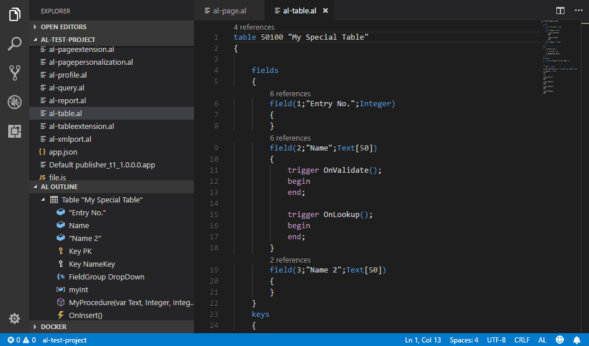
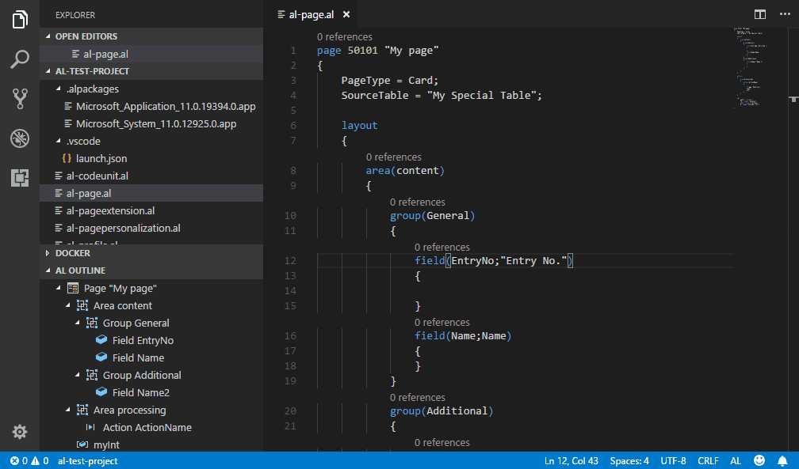

# AZ AL Dev Tools (AL Code Outline 2.0) for Visual Studio Code

This extension was originally named 'AL Code Outline' because it started as AL code outline panel from which it was possible to run different code generators on AL syntax nodes. Each new version has been adding new features, some of them were no longer related to the AL code outline panel. In the current version, outline panel is no longer the main extension feature, it has become a collection of different al development tools, so it seems that the name should be updated to reflect functionality changes.

## Features

### Code outline view 

'AL Outline' panel displays code outline of currently active editor. Basic functionality allows user to click on one of symbols tree nodes to move cursor to that symbol in the code editor. It looks like standard VS Code Outline view, but supports syntax nodes types specific to AL, display custom icons and allows to invoke some commands on them using context menu. Currently symbol context menu allows user to run pages, reports and tables in the web client and to create new card and list pages, reports, xmlports and queries with all fields from selected table symbols.

It also supports other document types, so it can be used instead of standard outline view if AL project contains other files (i.e. javascript or css control add-ins files). 

### Object browser

Extension adds a new "Open in AL Object Browser" entry to explorer contect menu for *.app files. It opens a view that looks similar to c/al object designer. When user selects object entry in this view, al code outline is updated with that object symbols. Right mouse click on object in the browser displays a context menu with options to show object definition and run table based object generators. Right click on object list column header opens another context menu (added by rvanbekkum), which allows to apply filter to the list.

It is also possible to select multiple rows in AL Object Browser by clicking on the lines with Ctrl or Shift keys pressed or by pressing Ctrl+A (another great rvanbekkum contribution). When multiple rows are selected, object generators will generate new files for all of them.

### File wizards

When this extension is installed, it also installs 'VZ File Templates' extension to allow users to select new file templates in a window that looks like the one from big Visual Studio. This extension registers there a few new AL file templates and wizards that help users to specify new object properties and select which fields should be added to these objects. Template selector is available in 'Explorer' panel context menu under 'New File from Template' option.

## Contributors

- rvanbekkum: 
  * "New Page Extension" and "New Table Extension" options in AL Object Browser
  * Ability to save generated objects in files inside project folder
  * Object browser search

## Integration with other Visual Studio Code extension

This extension uses functionalioty from thse Visual Studio Code extensions
- CRS AL Language Extension 
- VZ File Templates

## Inspiration

This extension has been inspired by "Code Outline" extension created by Patryk Zawadzki and "Tree Data Provider" example from "VS Code Extension Examples". I've decided to create it because I wanted something that could understand AL object structure and to be able to add some AL specific commands to tree nodes in the future. 

## Settings

This extension contributes the following settings:

* `alOutline.autorefresh`: refresh code outline tree automatically
* `alOutline.autoGenerateFiles`: automatically generate files for newly created objects
* `alOutline.autoGenerateFileDirectory`: the default directory to create files in, relative to the root directory (e.g., \"Source\<ObjectType\>\")
* `alOutline.autoShowFiles`: automatically show any newly created files in the editor
* `alOutline.defaultAppArea`: default application area for page code generator
* `alOutline.defaultListUsageCategory`: default usage category for list pages
* `alOutline.promptForObjectId`: when generating a new object, ask the user to input the object ID.
* `alOutline.promptForObjectName`: when generating a new object, ask the user to input the object name
* `alOutline.promptForFilePath`: when generating a new file, ask the user to specify a path relative to the root of the project-folder
* `alOutline.stripNonAlphanumericCharactersFromObjectNames`: always strip non-alphanumeric characters from generated object names
* `alOutline.webClientPort`: web client port number, use 0 for default http/https ports

## Known Issues

- When AL project is opened in Visual Studio Code, AL Code Outline pane might not be visible or might be empty even if one of *.al files is opened. You have to switch to another al file to display/refresh it.
- It takes some time to parse all *.al files when new project is opened so code outline will stay empty during that time. You can use Refresh button to force it to reload content. 
- Extension uses CRS-AL-LANGUAGE-EXTENSION for generating file names for new objects. As a result you will see plenty of new snippets added by the CRS extension. If you don't want to see them, go to Visual Studio settings and disable them in CRS-AL-LANGUAGE-EXTENSION section.

## About me

I'm .net and Dynamics Nav developer that moved from .net world to Dynamics Nav world in 2004. I've been using these 2 technologies since that year and currently I work as a Product Developer at The NAV People - the UK's number one reseller focused solely on Dynamics NAV thanks to its mission to provide a high level of expertise, amazing product innovation and the absolute best standard of customer service. The NAV People is truly unique in the world of NAV, check out our story here: https://thenavpeople.com/our-story 
