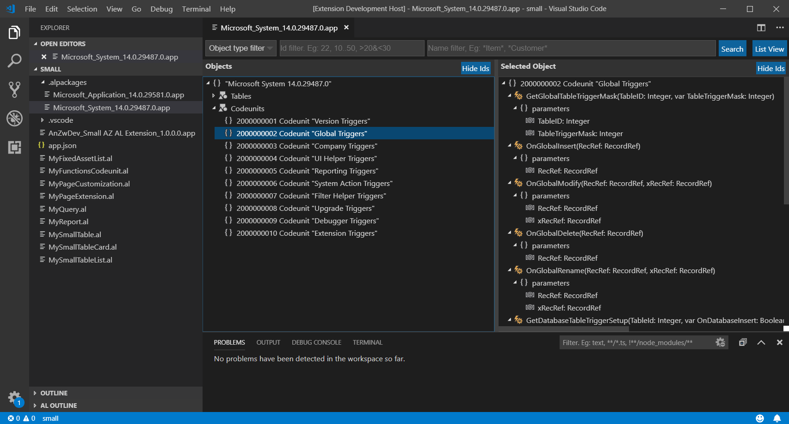
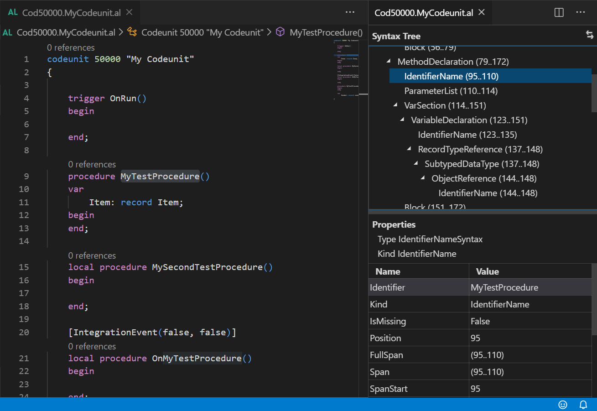

# AZ AL Dev Tools/AL Code Outline for Visual Studio Code

This extension was originally named 'AL Code Outline' because it started as AL code outline panel from which it was possible to run different code generators on AL syntax nodes. Each new version has been adding new features, some of them were no longer related to the AL code outline panel. Current version of the extension is a collection of different al development tools and al outline panel is just one of them, so it seems that the name should be updated to reflect functionality changes.

## Features

"AZ AL Dev Tools/AL Code Outline" extension is a collection of these tools designed to help with AL extension development:
- AL objects wizards
- Symbols browser
- AL symbols outline panel
- Symbols tree view
- AL code generators
- Code actions
- Code transformation commands
- Action images browser
- Documentation comments support
- Code analyzers rules viewer
- Document syntax visualizer

### AL objects wizards

Extensions add new "New AL File Wizard" item to EXPLORER context menu. It allows to run one of these wizards to create new AL object file:
   - Table Wizard
   - Page Wizard
   - Codeunit Wizard
   - Interface Wizard
   - XmlPort Wizard
   - Report Wizard
   - Query Wizard
   - Enum Wizard
   - Enum Extension Wizard

 

### Symbols browser

Symbols browser shows list of AL objects, allows to select one of them and then display details of that symbol. It is also possible to select multiple objects (by clicking on nodes with Ctrl key or using Ctrl+A) and then use context menu to run one of code generators on them. Browser can display symbols in 2 modes - list and tree view. In tree view screen is split into two parts showing objects tree on the left side and selected symbol on the right. In list view browser shows flat list of symbols and uses "AL Outline" panel to show details of selected object.

Both views support keyboard navigation with arrow keys and allow to filter data by using filter fields at the top of the screen.

Symbols browser can display symbols from:
 - *.app symbols file by right clicking on it and using "Open in AL Browser" command from the context menu
 - current project symbols with all dependencies defined in app.json by running "AZ AL Dev Tools: Show All Project Symbols" from the "Command Palette"
 - current project symbols without dependencies by running "AZ AL Dev Tools: Show Project Symbols without Dependencies" from the "Command Palette"





### AL symbols outline panel

'AL Outline' panel displays code outline of the currently active editor. Basic functionality allows user to click on one of the symbols tree nodes to move cursor to that symbol in the code editor. It looks like standard VS Code Outline view, but supports syntax node types specific to AL, display custom icons and allows to invoke some commands on them using context menu. Currently symbol context menu allows user to run pages, reports and tables in the web client and run code generators to create new card and list pages, reports, xmlports and queries with all fields from selected table symbols. For tables and pages it is also possible to create page or table extension.

It also supports other document types, so it can be used instead of standard outline view if AL project contains other files (i.e. javascript or css control add-ins files).


### Symbols tree view

This view shows symbols tree looking similar to content of "AL symbols outline panel", but uses WebView to display it and can be opened on one of the editor tabs. If there is an editor in which user changes definition of the object displayed in the tree view, tree content will be updated, but switching active editor to other file does not change the tree. It can be used to display table symbols when user edits page object or page symbols when developers edits page extension. View can be opened from:
- AL Symbols Browser by using object list context menu and selecting "Open symbol in new tab" option
- "Show Document Symbols Tree" command from "Command Palette" when there is an acive text editor with AL file
- Editor context menu by selecting "Show Definition in the Symbols Tree" menu item


### AL code generators

Extension contains code generators that can create new card and list pages, reports, xmlports and queries with all fields from selected table symbols. It can also create empty page or table extension from page or table symbols. Generators can be invoked using context menu on symbols in "AL Outline" view and in "Symbols Browser". 

When new objects are created, generators use "CRS AL Language Extension" templates functionality to suggest file names.

### Code actions

Extension adds VS Code editor code actions to some of al elements to help developers modify or insert code quickly. At this these types of actions available:
 - Sorting actions that can sort 
  - `Sort procedures` available when cursor is at the first line of a procedure. This action will sort procedures of the same type (i.e. local) in a natural order
  - `Sort data item columns` available when cursor is at report data item, column or first line of the object declaration. This action will sort all columns inside data item in a natural order. If it is invoked from the first line of the object, it will sort columns inside all data items.
  - `Sort properties` available from the first line of any object declaration. It will sort properties of every element declared inside the object.
  - `Sort variables` available from the first line of any object declaration or from "var" keyword of local or global variables section
 - Code generation actions
  - `Create interface` action available on the first line of codeunit declaration, it creates a new interface with all public functions from the codeunit
 - `Add multiple fields` when cursor is at these elements in the editor:
  - "group" and "repeater" on pages
  - "group", "repeater", "addfirst", "addlast", "addafter" and "addbefore" on page extensions
  - "dataitem" on reports
  - "dataitem" on queries
  There are also `Add multiple field elements` and `Add multiple field attributes` actions available at "tableelement", "fieldelement" and "fieldattribute" elements on xml ports.
  Fields can be added is selection or alphabetic order, it can be controlled using "alOutline.fieldsSelectionOrder" setting. Default value is "selection order".


Sort procedures, variables, properties and report columns actions can be also run automatically on document save. To turn this functionality on "source.fixAll.al" property of "editor.codeActionsOnSave" must be set to true and "alOutline.codeActionsOnSave" setting should contain list of sorting actions that you want to run. That's how settings should look like to run all these sort actions on save:

```javascript
"editor.codeActionsOnSave": {
  "source.fixAll.al": true
},
"alOutline.codeActionsOnSave": [
  "SortProcedures", "SortProperties", "SortReportColumns", "SortVariables"
]
```

There are also some additional code actions available for warnings and errors reported by CodeCop code analyzer:
 - add parentheses for diagnostics AA0008,
 - remove variable for diagnostics AA0137,
 - add CopyStr for diagnostics AA0139

### Code transformation commands

Extension adds a few commands that allow to automatically modify al code in the current editor or in all project files. Currently these commands are available:
* `Add Application Areas to the Active Editor`: adds missing application areas to all page controls in the current editor
* `Add Application Areas to the Active Project`: adds missing application areas to all page controls in the current project
* `Add ToolTips to the Active Editor`: adds missing tooltips to all page fields and actions in the current editor
* `Add ToolTips to the Active Project`: adds missing tooltips to all page fields and actions in the current project

Default application area and templates for field and action tooltips can be specified using these VS Code settings: `alOutline.defaultAppArea`, `alOutline.pageActionToolTip` and `alOutline.pageFieldToolTip` 


### Action images browser

Extension adds new "AZ AL Dev Tools: Show Action Images" command to the "Command Palette" to load all available action images from active Microsoft AL Language extension and show them in a single web view panel. Action images browser supports filtering, keyboard navigation and adds context menu to each image on the list.  Context menu contains these 3 actions:
   - Copy name - copies image name to the clipboard
   - Copy as action - generates page action element and copies it to the clipboard
   - Copy as promoted action - generates promoted page action element and copies it to the clipboard


### Documentation comments support

When developer types "///" in a line above a symbol declaration (i.e. variable, procedure, field), extension can add "Xml Documentation Comments" to the list of available completion items. When it is selected, xml documentation snippet will be inserted into the code editor. If symbol below cursor is a procedure declaration, inserted snippet will contail all procedure parameters. This functionality can be turned off and on by changing "alOutline.docCommentsType" setting to "none" or "xml".


### Code analyzers rules viewer

Code analyzers rules viewer can be opened by running "AZ AL Dev Tools: Show Code Analyzers Rules" command. It allows to select one of available code analyzers from a dropdown list and then displays all rules implemented by that analyzer in a table view. It is then possible to select some or all of the rules and create new ruleset file or copy them as ruleset rules or a table to the clipboard using context menu.


### Document syntax visualizer

Document syntax visualizer shows syntax tree created by the AL compiler for the current document. It can be opened by running "AZ AL Dev Tools: Open Document Syntax Visualizer" command. The main purpose of this functionality is to help developers create their own al code analyzers. More information how to create analyzer can be found on my blog here: https://anzwdev.wordpress.com/2019/11/09/custom-al-code-analyzers/



## Contributors

- rvanbekkum: 
  * "New Page Extension" and "New Table Extension" options in AL Object Browser
  * Ability to save generated objects in files inside project folder
  * AL Object Browser filters

## Inspiration

This extension has originally been inspired by "Code Outline" extension created by Patryk Zawadzki and "Tree Data Provider" example from "VS Code Extension Examples". I've decided to create it because I wanted something that could understand AL object structure and to be able to add some AL specific commands to tree nodes in the future. 

## Settings

This extension contributes the following settings:

* `alOutline.docCommentsType`: enable documention comments, available values: none, xml 
* `alOutline.autorefresh`: refresh code outline tree automatically
* `alOutline.autoGenerateFiles`: automatically generate files for newly created objects
* `alOutline.autoGenerateFileDirectory`: the default directory to create files in, relative to the root directory (e.g., \"Source\<ObjectType\>\")
* `alOutline.autoShowFiles`: automatically show any newly created files in the editor
* `alOutline.defaultAppArea`: default application area for page code generator
* `alOutline.defaultListUsageCategory`: default usage category for list pages
* `alOutline.promptForObjectId`: when generating a new object, ask the user to input the object ID.
* `alOutline.promptForObjectName`: when generating a new object, ask the user to input the object name
* `alOutline.promptForFilePath`: when generating a new file, ask the user to specify a path relative to the root of the project-folder
* `alOutline.stripNonAlphanumericCharactersFromObjectNames`: always strip non-alphanumeric characters from generated object names
* `alOutline.webClientPort`: web client port number, use 0 for default http/https ports
* `alOutline.openDefinitionInNewTab`: set to true to always open documents in a new tab from "Go to definition" command in "AL Object Browser"
* `fieldsSelectionOrder`: specifies how "Add multiple fields" functionality adds fields, available options are: "alphabetic" and "selection order"
* `alOutline.codeActionsOnSave`: list of code actions that should be run on document save, available options are: SortReportColumns, SortProperties, SortProcedures, SortVariables
* `alOutline.pageActionToolTip`: default tooltip template for page actions. Use %1 as placeholder for action caption or name
* `alOutline.pageFieldToolTip`: The default tooltip template for page fields. Use %1 as placeholder for field caption or name

## Known Issues

- When AL project is opened in Visual Studio Code, AL Code Outline pane might not be visible or might be empty even if one of *.al files is opened. You have to switch to another al file to display/refresh it.
- It takes some time to parse all *.al files when new project is opened so code outline will stay empty during that time. You can use Refresh button to force it to reload content. 
- Extension uses CRS-AL-LANGUAGE-EXTENSION for generating file names for new objects. As a result you will see plenty of new snippets added by the CRS extension. If you don't want to see them, go to Visual Studio settings and disable them in CRS-AL-LANGUAGE-EXTENSION section.

## About me

I'm .net and Dynamics Nav developer that moved from .net world to Dynamics Nav world in 2004. I've been using these 2 technologies since that year and currently I work as a Product Developer at The NAV People - the UK's number one reseller focused solely on Dynamics NAV thanks to its mission to provide a high level of expertise, amazing product innovation and the absolute best standard of customer service. The NAV People is truly unique in the world of NAV, check out our story here: https://thenavpeople.com/our-story 